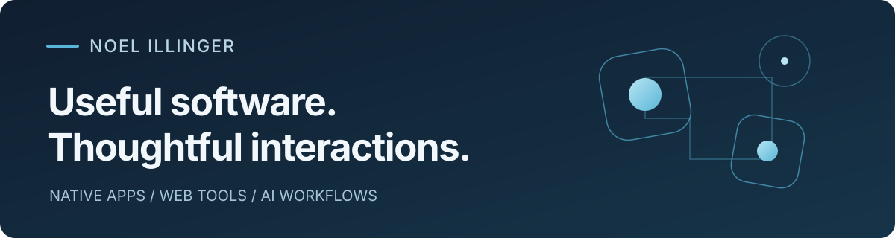

  

  <a href="https://noelhub.org/en/">Website</a> ·
  <a href="https://miracles.noelhub.org/en/">Miracles</a> ·
  <a href="https://noelhub.org/en/about/">About</a> ·
  <a href="https://noelhub.org/en/ki-agenten/">AI agents & automation</a>

## Hi, I'm Noel.

I'm a self-taught software builder in Germany, with a background in pipe fabrication, team coordination and design. I turn the friction I encounter into tools I want to use — from native iPhone experiences to practical web tools and AI workflows.

I care about the details that make software feel right: a readable answer, a responsive gesture, a clear calculation, a workflow that makes sense.

## Currently building · Miracles

**Your assistant. Right here.**

[Miracles](https://miracles.noelhub.org/en/) is an independent native iOS client for your own OpenClaw assistant. It grew out of wanting to continue my everyday conversations naturally on iPhone.

- Live answers, comfortable reading and quick navigation between conversations.
- Photos, files, message replies and native text selection.
- Your own OpenClaw gateway, agents and model access.

**Status:** internal TestFlight testing; external beta in preparation. Requires iOS 26+ and your own gateway and model access. No public download yet.

[Explore the app](https://miracles.noelhub.org/en/) · [Setup guide](https://miracles.noelhub.org/en/setup/)

## Selected work

### A small suite for ideas and words

Three tools I built for the way I work with Amber. **In private use**, not public sign-up products:

- **[Spark](https://noelhub.org/en/projects/spark/)** captures ideas, tasks and questions with images, priorities and a record of progress. Its native iOS companion is in internal TestFlight testing.
- **[Cadence](https://noelhub.org/en/projects/cadence/)** is a writing studio for website copy, posts and product stories, with sources, variants and revision history.
- **[Fadenly](https://noelhub.org/en/projects/nodelume/)**, formerly NodeLume, is a visual workspace: freeform cards, connections and searchable boards for ideas that do not fit in a list.

### [PipingData](https://pipingdata.org/)

**Live website · German · No sign-in needed.** A piping reference with a component catalogue, pipe weight and internal-volume calculators, quantity lists and practical explanations. The public reference sits alongside my work on [PipeFlow](https://noelhub.org/en/projects/pipeflow/), which focuses on fabrication workflows.

### [build-agent-plugins](https://github.com/noelillinger/build-agent-plugins)

**Open source · MIT-0.** A reusable agent skill for choosing, building and testing portable Agent Plugins, MCP servers and skill bundles.

### [Soother](https://noelhub.org/en/projects/soother/)

**In development.** A tactile iOS experiment: a soft bubble, responsive motion and haptics. A little moment with nothing to get done.

[More projects on noelhub.org](https://noelhub.org/en/#work)

## How I build

Swift and SwiftUI for native experiences. TypeScript and web technologies for useful, accessible tools. MCP and agent workflows where they solve a concrete problem.

I work with **Amber, my AI agent**, on research, design, implementation and review. I bring the direction, try things in practice and take responsibility for what I publish. [More about our collaboration →](https://noelhub.org/en/about/)

## In the OpenClaw ecosystem

I use OpenClaw daily and contribute reproducible bug reports, source analysis and follow-up evidence. Two reports that led to merged fixes:

- **Avoiding a minute-long Computer Use startup wait:** [my report #125360](https://github.com/openclaw/openclaw/issues/125360) traced unnecessary polling when native plugins were disabled. [Fix #137485](https://github.com/openclaw/openclaw/pull/137485), implemented by shojikumaru, merged on 8 September 2026.
- **Keeping the waiting timer tied to the current turn:** [my report #139950](https://github.com/openclaw/openclaw/issues/139950) documented old elapsed time appearing on new messages. [Fix #139972](https://github.com/openclaw/openclaw/pull/139972), implemented by NianJiuZst, merged on 6 September 2026.

Other investigations include [automation-list visibility](https://github.com/openclaw/openclaw/issues/134502), [plugin data bindings in MCP overlays](https://github.com/openclaw/openclaw/issues/129602) and [a WebKit rendering stall](https://github.com/openclaw/openclaw/issues/152861).

[All my OpenClaw reports](https://github.com/openclaw/openclaw/issues?q=is%3Aissue%20author%3Anoelillinger)

Miracles is an independent project, not an official OpenClaw product.

---

**Have a practical problem in mind?** [Explore AI-agent setup and automation help](https://noelhub.org/en/ki-agenten/) or [get in touch](https://noelhub.org/en/ki-agenten/#contact).

[Legal notice / Impressum](https://noelhub.org/en/impressum/)
